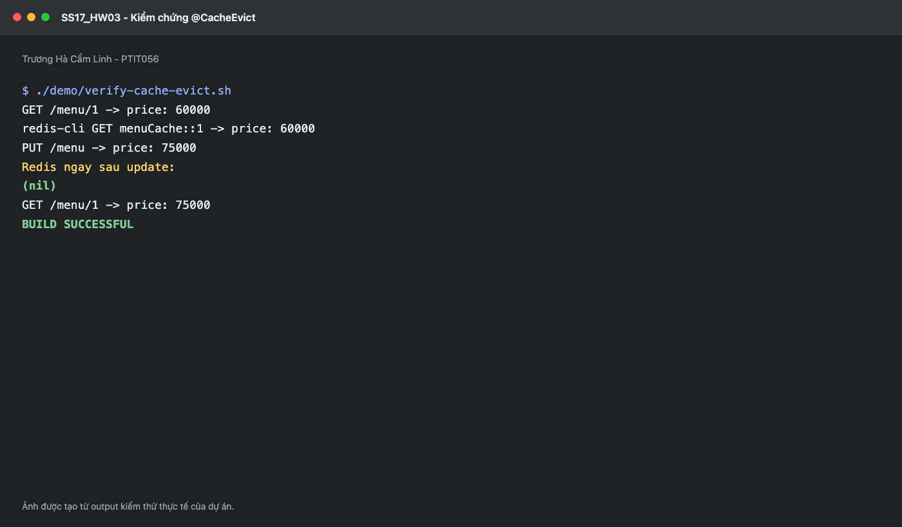

# SS17_HW03 - Đảm bảo nhất quán dữ liệu với @CacheEvict

## 1. Cache-Aside cho GrabFood

GrabFood dùng database làm nguồn dữ liệu chính và Redis để tăng tốc API đọc giá món ăn. Luồng đọc:

1. `GET /menu/{id}` kiểm tra `menuCache::id`.
2. Cache hit trả dữ liệu ngay.
3. Cache miss gọi DB, sau đó nạp kết quả vào Redis.

Luồng cập nhật:

1. Kiểm tra `id`, `dish_name`, `price >= 0`.
2. Gọi `menuRepository.save(menu)` và `flush()` để cập nhật DB trước.
3. Method trả thành công thì Spring thực hiện `@CacheEvict` xóa key cũ.
4. GET kế tiếp miss cache, đọc giá mới từ DB và nạp lại Redis.

## 2. Annotation đúng yêu cầu

```java
@Transactional
@CacheEvict(value = "menuCache", key = "#menu.id")
public Menu updateMenu(Menu menu) {
    Menu saved = menuRepository.save(menu);
    menuRepository.flush();
    return saved;
}
```

`beforeInvocation` mặc định là `false`, nên cache chỉ bị xóa khi method hoàn thành thành công. Nếu validation hoặc DB lỗi, key hiện tại không bị xóa vô ích.

## 3. Vì sao chọn @CacheEvict thay cho @CachePut?

`@CachePut` chạy method rồi ghi kết quả mới trực tiếp vào cache. Nó giữ cache nóng nhưng tạo thêm một thao tác ghi dữ liệu. Khi hai update chạy song song, thứ tự ghi Redis có thể khác thứ tự commit cuối cùng của DB: request cũ hoàn tất cache muộn có thể ghi đè request mới và gây stale data.

`@CacheEvict` không cố đồng bộ hai bản sao bằng hai lệnh ghi. Sau khi DB cập nhật, hệ thống chỉ xóa cache. Lượt đọc tiếp theo luôn tái tạo cache từ nguồn dữ liệu chính. DELETE lặp lại cũng có tính idempotent và đơn giản hơn khi retry.

Evict không loại bỏ mọi race condition phân tán. Trong hệ thống lớn có thể bổ sung optimistic locking, invalidation event sau commit, delayed double delete hoặc version trong cache. Tuy nhiên, với yêu cầu bài này, DB-first rồi evict là lựa chọn dễ hiểu và an toàn hơn ghi đè.

## 4. Input mẫu

```json
{
  "id": 1,
  "dish_name": "Phở Bò Đặc Biệt",
  "price": 75000
}
```

Entity dùng `@JsonProperty("dish_name")` nên JSON giữ đúng cấu trúc đề bài trong khi Java dùng tên thuộc tính `dishName`.

## 5. Cài đặt và chạy

```bash
docker compose up -d
./gradlew clean test
./gradlew bootRun
```

Dữ liệu ban đầu: menu id `1`, giá `60000`.

Chạy kiểm chứng đầy đủ:

```bash
chmod +x demo/verify-cache-evict.sh
./demo/verify-cache-evict.sh
```

Script dùng Redis CLI để in key ở ba thời điểm:

- Sau GET đầu: `menuCache::1` tồn tại, chứa giá 60000.
- Ngay sau PUT: `GET menuCache::1` trả `(nil)`.
- Sau GET lần cuối: key được tạo lại, chứa giá 75000.

### Ảnh chụp kiểm chứng



## 6. Lệnh kiểm tra thủ công

```bash
curl http://localhost:8080/menu/1

redis-cli GET 'menuCache::1'

curl -X PUT http://localhost:8080/menu \
  -H 'Content-Type: application/json' \
  -d '{"id":1,"dish_name":"Phở Bò Đặc Biệt","price":75000}'

redis-cli GET 'menuCache::1'

curl http://localhost:8080/menu/1
```

## 7. Test tự động

Ba test kiểm tra:

- Method có đúng `@CacheEvict(value="menuCache", key="#menu.id")`.
- Repository thực hiện `save()` rồi `flush()` trước khi method trả về.
- Giá âm bị từ chối trước khi chạm database.

## 8. Xử lý Redis lỗi

`CacheErrorHandler` cho phép GET fallback xuống DB nếu Redis tạm lỗi và ghi log khi evict thất bại. TTL 10 phút là lớp an toàn để key cũ không tồn tại vô hạn. Production nên thêm metric/alert và retry invalidation qua message queue hoặc transactional outbox.
